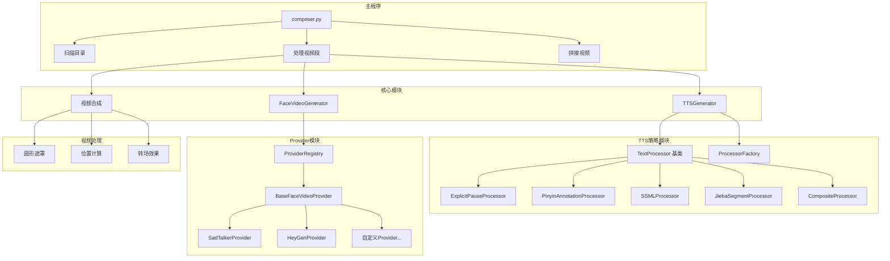
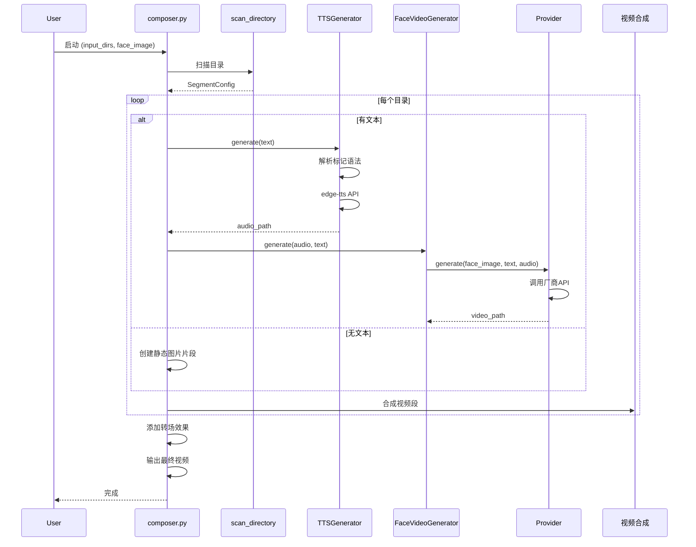
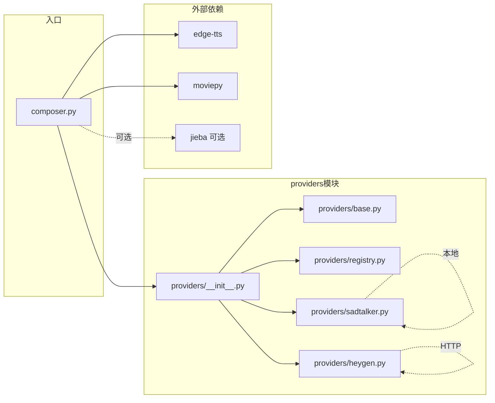
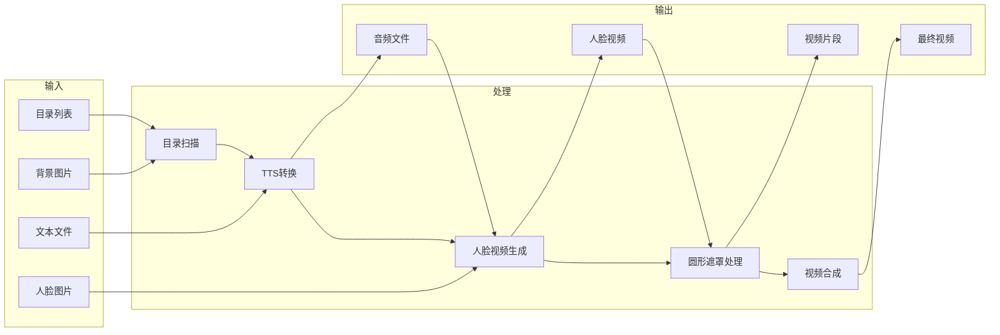
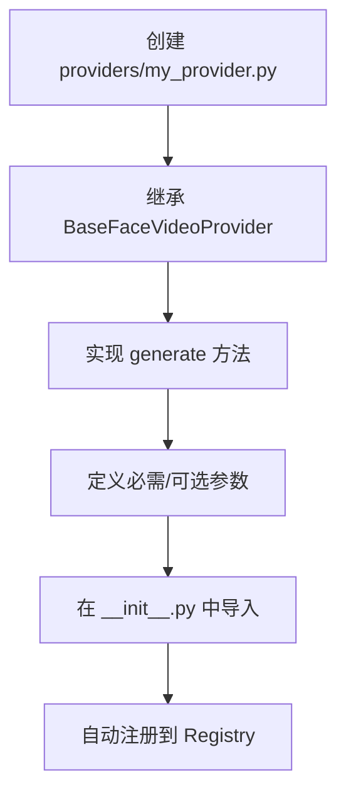
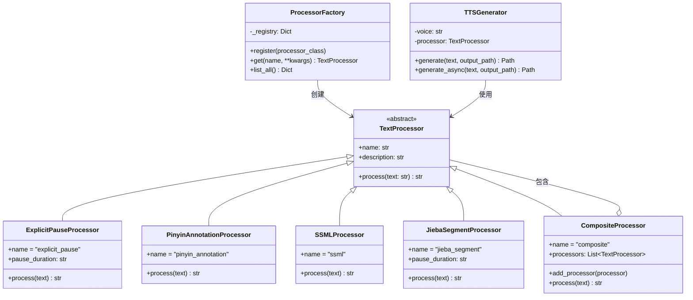
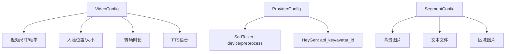

# 视频合成工具架构文档

## 整体架构



## 调用流程



## Provider 模块架构

```mermaid
classDiagram
    class BaseFaceVideoProvider {
        <<abstract>>
        +name: str
        +description: str
        +config: Dict
        +generate(face_image, text, output_path, **kwargs) FaceVideoResult
        +get_required_params() list
        +get_optional_params() list
        +_validate_config()
    end

    class ProviderRegistry {
        -_providers: Dict
        +register(name, provider_class)
        +unregister(name) bool
        +get(name, config) BaseFaceVideoProvider
        +list_providers() Dict
        +is_registered(name) bool
    end

    class SadTalkerProvider {
        +name = "sadtalker"
        +API_BASE: str
        +generate()
        +get_required_params()
        +get_optional_params()
        -_build_command()
        -_run_command()
    end

    class HeyGenProvider {
        +name = "heygen"
        +API_BASE: str
        +generate()
        +get_required_params()
        +get_optional_params()
        -_create_video()
        -_poll_status()
        -_download_video()
    end

    class FaceVideoGenerator {
        -face_image_path: Path
        -provider: BaseFaceVideoProvider
        +generate(audio_path, output_path, text) Path
    end

    ProviderRegistry --> BaseFaceVideoProvider : 管理
    BaseFaceVideoProvider <|-- SadTalkerProvider
    BaseFaceVideoProvider <|-- HeyGenProvider
    FaceVideoGenerator --> BaseFaceVideoProvider : 使用
    FaceVideoGenerator --> ProviderRegistry : 获取Provider
```

## 模块依赖关系



## 数据流



## 扩展 Provider

添加新的 Provider 只需：



示例代码结构：

```python
# providers/my_provider.py
from .base import BaseFaceVideoProvider, FaceVideoResult
from .registry import register_provider

@register_provider("my_provider")
class MyProvider(BaseFaceVideoProvider):
    name = "my_provider"
    description = "我的 Provider"

    def get_required_params(self):
        return ["api_key"]

    def generate(self, face_image, text, output_path, **kwargs):
        # 实现生成逻辑
        ...
        return FaceVideoResult(video_path=output_path)
```

## TTS 文本处理策略模式



### 策略使用示例

```python
# 方式1: 默认策略（显式停顿 + 拼音标注）
tts = TTSGenerator()

# 方式2: 单一策略
tts = TTSGenerator(processor_name="jieba_segment")

# 方式3: 组合策略
tts = TTSGenerator(processor=CompositeProcessor()
    .add_processor(ProcessorFactory.get("jieba_segment"))
    .add_processor(ProcessorFactory.get("explicit_pause"))
    .add_processor(ProcessorFactory.get("pinyin_annotation")))
```

### 处理效果

| 策略 | 输入 | 输出 |
|------|------|------|
| explicit_pause | `武汉市\|长江二桥` | `武汉市<break time="200ms"/>长江二桥` |
| pinyin_annotation | `市[shi4]` | `<phoneme ph="shi4">市</phoneme>` |
| ssml | `<break time="500ms"/>` | `<break time="500ms"/>` (原样) |
| jieba_segment | `武汉市长江二桥` | `武汉市<break time="200ms"/>长江二桥` |

## 配置层级


